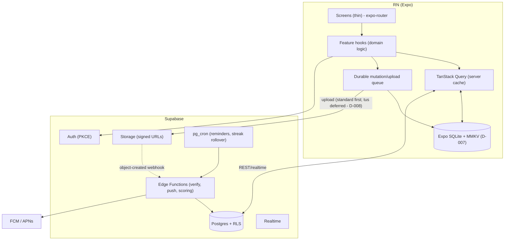

# Basta — Architecture Proposal

> **Status: PROPOSAL (pre-implementation).** No code written, no Supabase migrations applied.
> This is the umbrella document. Companion docs:
> [`DATA_MODEL.md`](DATA_MODEL.md) · [`OFFLINE_SYNC.md`](OFFLINE_SYNC.md) ·
> [`NAVIGATION.md`](NAVIGATION.md) · [`SUPABASE_SCHEMA_DRAFT.md`](SUPABASE_SCHEMA_DRAFT.md).
> Locked decisions live in [`../claude-memory/DECISIONS.md`](../claude-memory/DECISIONS.md).

## 1. Recommended Architecture

**Shape:** offline-first React Native client in a layered, feature-sliced structure; Supabase as a
server-authoritative backend. Reads flow through a server cache (TanStack Query) mirrored to a
local DB; writes flow through a durable queue that survives restarts and bad networks. Anything
scored or social is computed and owned by the server.

**The three load-bearing ideas:**
1. **Server-authoritative scoring** (D-003) — streaks, leaderboards, verification, and the
   day-boundary all live in Postgres. The client never decides a score.
2. **Offline-first capture** (D-004) — a proof draft + its media are written to the device sandbox
   *at capture time*, before any network call. A durable queue drains when connectivity returns.
   **This is the MVP critical path.**
3. **Thin screens, fat features** (D-002) — route files compose layout and bind navigation; all
   logic lives in feature hooks → domain → data layers.



**Tech responsibilities:** Auth + RLS (Supabase Auth); scoring/verification (Postgres functions +
pg_cron); media (Storage, private bucket + short-TTL signed URLs); push scheduling (Edge Function +
pg_cron). Client state split is in [`OFFLINE_SYNC.md`](OFFLINE_SYNC.md).

## 2. Folder Structure

Route screens are thin; logic lives in `src/features/`. Full tree mirrored in
[`../claude-memory/FILE_MAP.md`](../claude-memory/FILE_MAP.md).

```
app/                              # routes = THIN screens (expo-router)
  _layout.tsx                     # providers, theme, query client, auth guard
  (auth)/  sign-in · sign-up · verify-email
  (onboarding)/  profile-setup · join-or-create-group
  (tabs)/  index(Today) · challenges · groups · profile
  challenge/[id]/  index · submit-proof(modal)
  group/[id]/index                # leaderboard + members
  verify/[submissionId]           # friend verification (push deep-link)
src/
  features/<domain>/              # auth, proof, challenges, verification,
    api/                          #   groups, leaderboard, feed, moderation, notifications
    hooks/                        # business logic (useSubmitProof, useStreak…)
    model/                        # zod schemas, feature state
    ui/                           # feature-local components
    index.ts                      # public surface (others import ONLY this)
  entities/  + mappers/           # domain models; DTO → domain (never raw rows in UI)
  shared/  ui/theme · lib · gestures · utils
  offline/  db · queue · upload   # the heart of offline-first
  services/  analytics · notifications · crash
  navigation/  linking.ts · guards.ts
supabase/  migrations · functions · seed.sql
__tests__/   e2e/(Maestro)   .github/workflows/
```

> **Note on `features/feed`:** this is the **in-group activity feed** rendered on the **Today**
> screen (your group's recent proofs/verifications). It is NOT a public/Explore feed. A public
> **Explore feed is explicitly post-MVP** (see [`NAVIGATION.md`](NAVIGATION.md) and DECISIONS
> D-006).

**Enforced boundary (ESLint `import/no-restricted-paths`):** `app/` → `features`, `shared`;
`features/` → `entities`, `shared`, `offline`; `entities/` → nothing app-specific; no feature
reaches into another feature's internals (import only its `index.ts`).

## 3. MVP Implementation Phases

Mapped to [`../claude-memory/TASKS.md`](../claude-memory/TASKS.md). ~10 weeks to beta, 2–3 engineers.

| Phase | Focus | Tasks | Exit criteria |
|---|---|---|---|
| **0 — Foundations** | Repo, scaffold, design system, tooling | T-001✓, T-002, T-010–T-014 | App boots; tokens/primitives; lint boundaries; Sentry+analytics |
| **1 — Auth & onboarding** | Email PKCE, profile, groups | T-020–T-023 | Sign up → profile → create/join group |
| **2 — Challenges & proof (critical path)** | Challenge CRUD, camera capture, durable queue | T-030–T-035, T-003 | **Offline photo submit → reconnect → reconciles** |
| **3 — Social & scoring** | Verification, reactions/comments, server streak+leaderboard | T-040–T-043 | Friend verify flips status; streak + group leaderboard update server-side |
| **4 — Notifications & T&S** | Push reminders, report/block, deletion | T-050–T-052 | Reminders with quiet hours/caps; report/block; in-app account deletion |
| **5 — Hardening & release** | Tests, CI/EAS, store | T-060–T-062 | Maestro E2E (incl. offline) green; EAS build; beta |

**Critical path = Phase 2.** If the offline-capture → queue → reconcile loop isn't solid, the
product's core promise fails. Phases 3+ build on it.

**Scope guard (D-006):** do NOT build AI verification, **Explore/public feed**, global
leaderboards, full chat, health integrations, XP/badges/duels, widgets, or monetization. The
architecture leaves only thin placeholders (e.g. a future `verification_source` column for AI).

## Open decisions referenced here
- **D-007** — local persistence engine: **Expo SQLite + MMKV** (Accepted; WatermelonDB deferred).
  See DECISIONS.md.
- **D-008** — media upload: start with **standard Supabase Storage upload**; **defer tus/resumable**
  unless/until video proof needs it. See DECISIONS.md.
