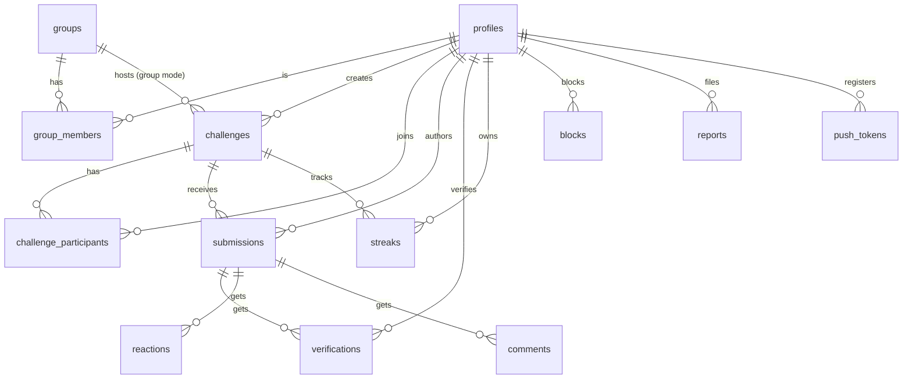

# Basta — Data Model

> **Status: PROPOSAL (pre-implementation).** Domain-level model. The concrete SQL draft is in
> [`SUPABASE_SCHEMA_DRAFT.md`](SUPABASE_SCHEMA_DRAFT.md) — **not applied yet**.

## Entities

| Entity | Purpose | Key notes |
|---|---|---|
| `profiles` | 1:1 with `auth.users` | Holds `timezone` (drives day-boundary, D-003), `onboarded`, `terms_version`. |
| `groups` / `group_members` | Friend groups + membership | `invite_code` for join links; roles owner/admin/member. |
| `challenges` | Solo or group challenge | `mode ∈ {solo,group}`; solo ⇒ `group_id NULL`; has `category`, `start_date`, `duration_days`, `verification_threshold` (default 1). |
| `challenge_participants` | Who is doing a challenge | Composite PK `(challenge_id, user_id)`. |
| `submissions` | Daily proof | Carries **server** `challenge_day` (int from `start_date` in author tz) + `status`. **Unique `(challenge_id, author_id, challenge_day)`** → one proof per day. `id` is the client-generated UUID (idempotency). |
| `verifications` | Friend verification | Unique `(submission_id, verifier_id)`; trigger forbids verifying your own; threshold flips submission → `verified`. |
| `reactions` / `comments` | Lightweight social | Comments capped at 500 chars. |
| `streaks` | Server-maintained projection | Updated by function/trigger on verify — **never client-computed** (D-003). |
| `reports` / `blocks` | Trust & safety | Blocks filter visibility both directions via RLS. |
| `push_tokens` / `notification_prefs` | Push delivery | Quiet hours + daily cap + reminders toggle. |

## Server-authoritative state (client must NEVER compute)

- **Streaks** — recomputed server-side on verification; day-boundary uses `profiles.timezone`.
- **Leaderboards** — a Postgres view/function aggregating verified submissions per group challenge.
- **Verification result** — `pending_verification → verified | rejected`, owned by the server.
- The client only owns `draft → uploading` and the offline queue until the server acknowledges.

## Sync-relevant fields

`submissions.status` is the on-server portion of the sync state machine; the client adds the
local-only `draft` and `uploading` states before a row exists server-side. See
[`OFFLINE_SYNC.md`](OFFLINE_SYNC.md).

## Post-MVP placeholders (do not build now)

- AI verification → a future `submissions.verification_source` column (`friend` | `ai`).
- Explore/public feed, global leaderboards → no schema yet; **post-MVP** (DECISIONS D-006).
