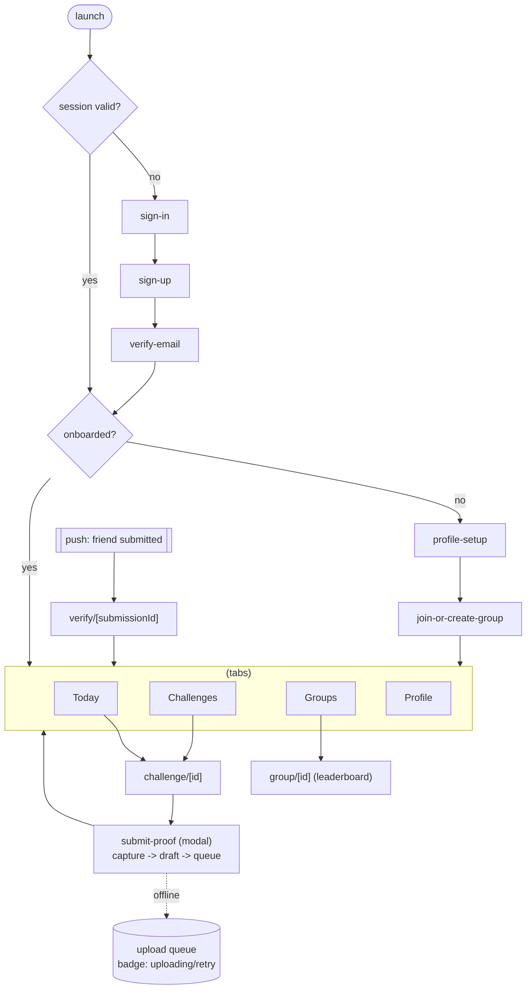

# Basta — Navigation Structure

> **Status: PROPOSAL (pre-implementation).** expo-router, file-based, typed.

## Flows

- **Auth** group — email + PKCE. Email-verify deep-link carries a one-time token **in the body,
  never the URL**.
- **Onboarding** — gated on a server `profiles.onboarded` flag: profile setup → join/create group
  (invite link or search).
- **Main tabs** — **Today**, Challenges, Groups, Profile.
- **Challenge detail** → primary CTA opens **submit-proof** as a modal route (camera-first). The
  screen returns immediately while the upload runs in the background queue; a sync badge reflects
  status wherever the submission appears.
- **Verification** — reached via push deep-link to `verify/[submissionId]`; the server enforces who
  may verify (not your own submission).
- **Error/offline** — global offline banner + per-item sync badge + query-error fallback with retry.

## Today tab (scope clarification)

The **Today** tab shows the user's due tasks plus the **in-group activity feed** (recent
proofs/verifications from the user's groups). It is intentionally named **"Today"** (not
"Today/Feed") to avoid implying a general feed surface.

> ⚠️ **Explore / public feed is POST-MVP** and must not be built now. The only feed in the MVP is
> the bounded, in-group activity shown on Today. A public/global Explore feed is excluded by
> DECISIONS D-006.

## Navigation rules

- Configuration (linking, guards) lives in `src/navigation/`, separate from feature
  implementations.
- Auth + onboarding guards redirect at the layout level (`app/_layout.tsx`), not inside screens.
- Deep links never carry sensitive data.

## Onboarding gate (implemented — `src/navigation/guards.ts` → `useOnboardingGate`)

The gate centralizes routing decisions so `app/_layout.tsx` stays thin. The server profile is
the source of truth (D-003); local state never decides routing.

| Session     | Profile       | Terms vs CURRENT | Onboarded | Target                              |
|-------------|---------------|------------------|-----------|-------------------------------------|
| `loading`   | —             | —                | —         | (no redirect — loading splash)      |
| `signedOut` | —             | —                | —         | `/(auth)/sign-in`                   |
| `signedIn`  | loading/error | —                | —         | (no redirect — loading splash)      |
| `signedIn`  | `null`        | —                | —         | `/(onboarding)/profile-setup`       |
| `signedIn`  | present       | mismatch         | —         | `/(onboarding)/profile-setup`       |
| `signedIn`  | present       | match            | `false`   | `/(onboarding)/join-or-create-group`|
| `signedIn`  | present       | match            | `true`    | `/(tabs)`                           |

Loop avoidance: the layout only calls `router.replace(target)` when `isAtTarget(segments,
target)` is false. Auth → on signed-in transition → goes through full gate, never lands on `(tabs)`
unconditionally.
